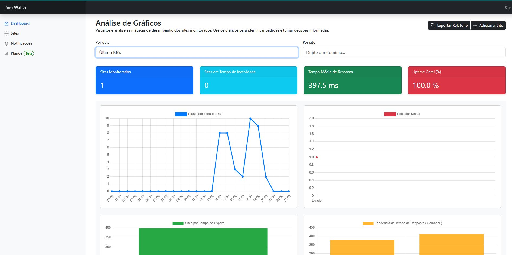
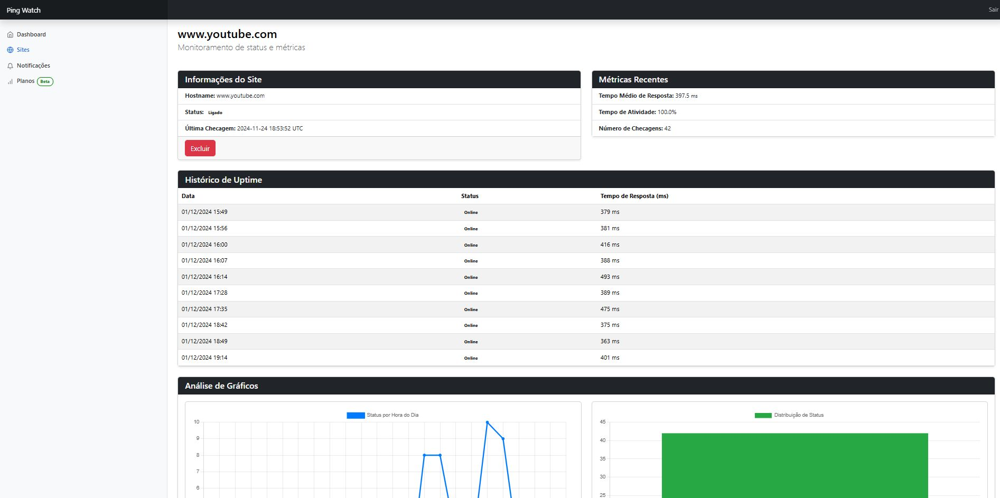
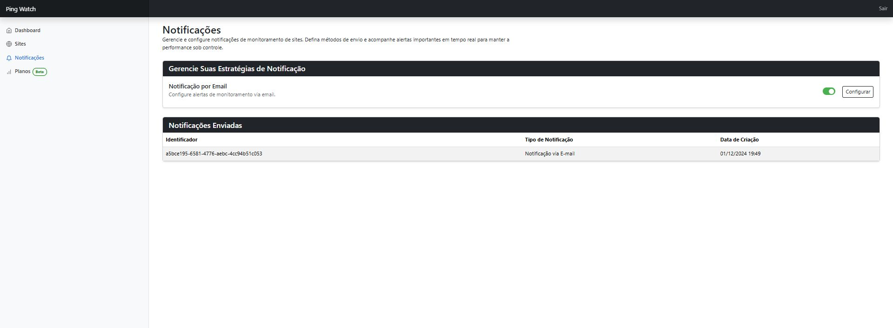
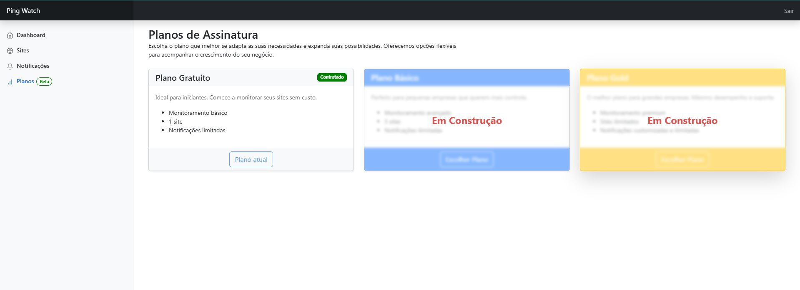

# Ping Watch

## Visão Geral
Ping Watch é uma aplicação desenvolvida para monitorar a disponibilidade de websites e notificar seus usuários sobre alterações de status, além de oferecer relatórios detalhados e gráficos com métricas relevantes.

<p align="center">
  
  
</p>
<p align="center">
  
  
</p>

## Tecnologias Utilizadas
- **Ruby**: Linguagem principal da aplicação.
- **Ruby on Rails**: Framework utilizado para o desenvolvimento da aplicação.
- **Hotwire**: Ferramente para atualização dos gráficos por filtros sem a necessidade de uma nova renderização.
- **PostgreSQL**: Banco de dados relacional para armazenamento das informações.
- **Bootstrap**: Framework CSS para estilização e criação de um layout responsivo.
- **Sidekiq**: Gerenciamento de jobs em background para tarefas assíncronas.
- **Redis**: Armazenamento utilizado pelo Sidekiq.
- **Devise**: Gem para sistema de autenticação e gerenciamento de usuários.
- **Fly.io**: Plataforma de hospedagem da aplicação.

## Funcionalidades

### Monitoramento de Sites
- Monitoramento periódico da disponibilidade de websites.
- Identificação de mudanças de status (online/offline).

### Notificações e E-mails
- Envio de e-mails automáticos quando um site altera seu status.
- Configuração personalizada de notificações pelos usuários.

### Relatórios e Gráficos
- Gráficos interativos mostrando a disponibilidade dos sites ao longo do tempo.
- Exportação de relatórios contendo métricas de uso em formatos como XLSX ou PDF.

### Sistema de Usuários
- Autenticação e criação de usuários utilizando o Devise.
- Gerenciamento de preferências e notificações de cada usuário.

### Integração com Sidekiq
- Uso de jobs assíncronos para o monitoramento periódico dos websites.
- Processamento de notificações e geração de relatórios em segundo plano.

## Deploy
A aplicação está hospedada no Fly.io, garantindo alta disponibilidade e desempenho confiável.

## Como Usar

### 1. Forkar o Repositório
1. Acesse o repositório no GitHub.
2. Clique no botão **Fork** no canto superior direito da página.

### 2. Clonar o Repositório
Depois de forkar o projeto, clone o repositório para sua máquina local:
```bash
git clone https://github.com/joao-carlos-pereira-alves/ping-watch.git
```

### 3. Configurar o Banco de Dados
Certifique-se de que o Docker esteja instalado. Para iniciar o PostgreSQL com Docker Compose, execute:
```bash
docker-compose -f docker-compose.dev.yml up --build
```

### 4. Instalar Dependências
Navegue até o diretório do projeto e instale as dependências:
```bash
bundle install
```

### 5. Configurar o Banco de Dados
Crie e migre o banco de dados:
```bash
rails db:create db:migrate
```

### 6. Inicializar a Aplicação
Inicie o servidor Rails:
```bash
rails server
```

A aplicação estará disponível em [http://localhost:3000](http://localhost:3000).

